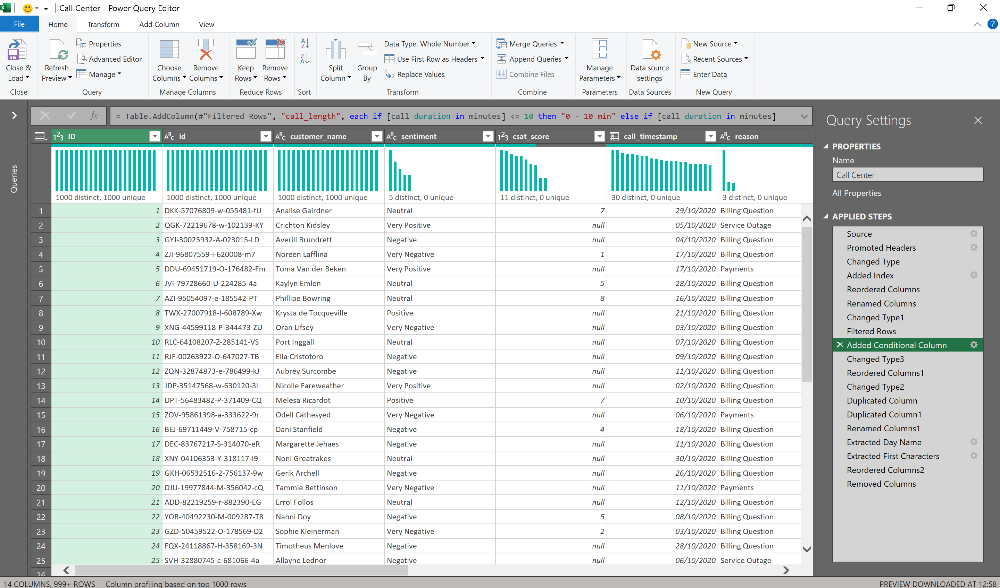
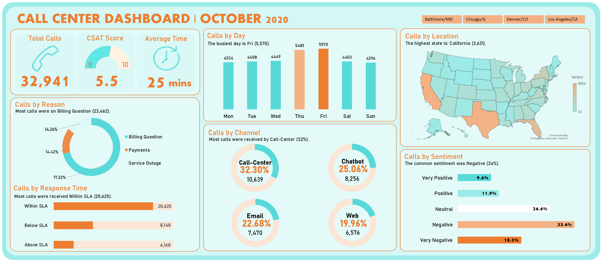
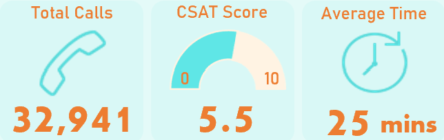
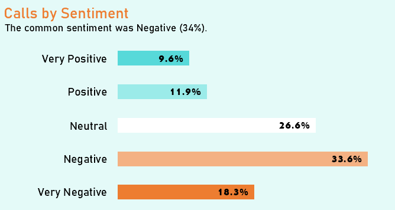
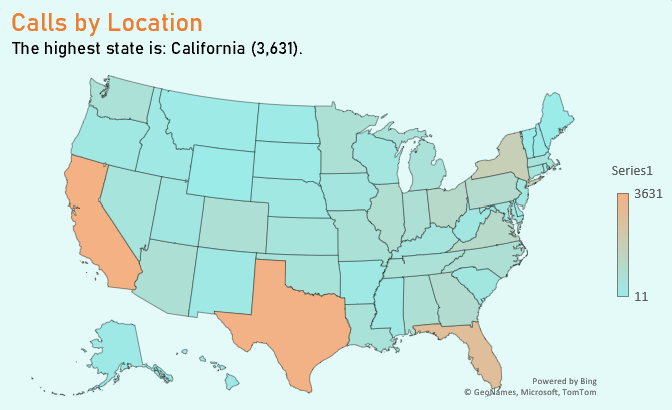
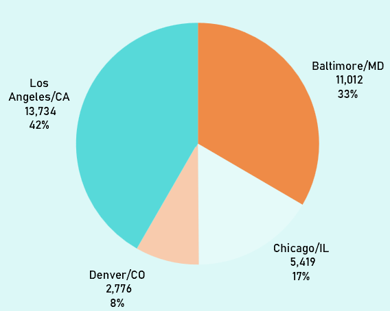
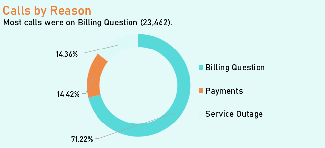
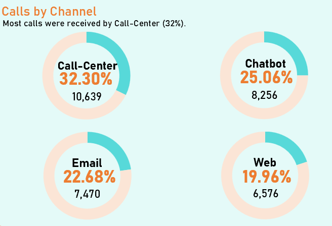
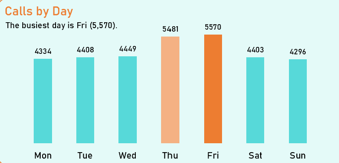
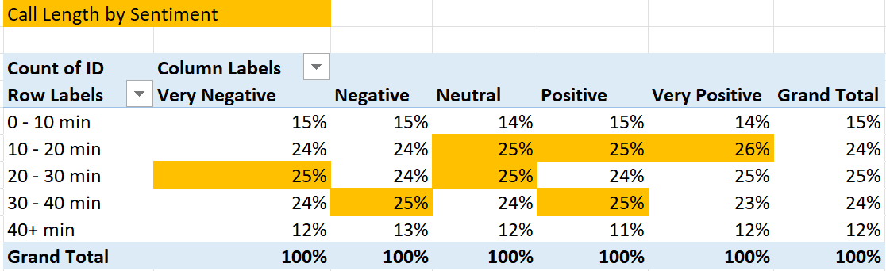

# Call-Centre-Monthly-Overview
#### Performance Analysis, October 2020

### Overview

This project analyses 32,941 customer interactions handled by a call centre organisation across 4 locations, 4 channels, and 50 states for October 2020. The goal was to move beyond a single "customer satisfaction is low" headline and identify where or whether poor experience is concentrated, so the business knows what actually to fix.

### The Problem

Sentiment across the dataset skews negative - the immediate question for the business is: **is this a localised problem (a specific centre, channel, or issue type underperforming) or a systemic one?** Those two answers point to completely different fixes - targeted retraining and staffing at a weak site vs. a broader review of process, policy, or product experience. The analysis needed to distinguish between them before recommending anything.

### The Approach/ Process
**Tools:** Excel (Power Query, PivotTables, PivotCharts)

**1. ETL: Clean & Prep the Data (Power Query)**

- Counted rows and checked for duplicates (customer IDs & names were confirmed as unique and distinct)
- Created a separate index/ID column
- Corrected data types across certain columns
- Standardised date format (British to American)
- Created a conditional column grouping calls into call-length groups
- Extracted the day of the week from call timestamps

**2. Exploratory Data Analysis (PivotTables)**

- Built pivot tables to explore the data from different angles: sentiment, channel, reason for contact, and response time.
- Cross-tabbed sentiment against call centre, channel, and contact reason to check where negativity concentrates.
- Cross-tabbed response time (SLA status) against sentiment.

**3. Data Visualisation: Build the Dashboard**

The dashboard includes:
- **KPIs:** Total Calls, Average CSAT Score, Average Response Time
- **Calls by Sentiment** - Distribution across the 5 sentiment tiers: Very Negative, Negative, Neutral, Positive, Very Positive
- **Calls by Reason** - Billing Question, Payments, Service Outage
- **Calls by Channel** - Call-centre, Chatbot, Email, Web
- **Calls by Response Time** - Within / Below / Above SLA
- **Calls by Day** - Weekday volume pattern
- **Calls by State** - Geographic distribution (USA)
- **Slicer** - Filtering by call centre location

**4. Reporting & Insight Generation**

### Key Insights

**1. Average CSAT sits at 5.5/10.**

- This figure is calculated from only 37% of interactions (CSAT was not captured for majority of the calls), so it should be treated as directional rather than a fully representative organisation-wide score. It's presented here as a KPI, but any decision built on it should account for that coverage gap.

2. **Negativity is not concentrated anywhere.**
   

- Sentiment distribution is nearly identical across all four call centres (Negative sits at 33–34% and Very Negative at 18% in every location). If this were a site-specific performance problem, we'd expect meaningfully different rates between centres. We don't see that, which points toward a shared root cause - likely tied to the customer experience itself (e.g., billing process or communication) rather than how or where a call is handled.

3. **Sentiment skews negative overall.**
   

- Across all interactions: 33.6% Negative, 18.3% Very Negative, 26.6% Neutral, 11.9% Positive, 9.6% Very Positive - meaning roughly 52% of interactions land in the two negative tiers, and only about 22% are positive.

4. **Volume is concentrated by geography.**
   

- Most calls originate from California, Texas, Florida, New York, and Virginia. California alone accounts for 3,631 interactions, the highest of any state.

5. **Los Angeles/CA and Baltimore/MD carry the bulk of the volume.**
   

- Los Angeles/CA handles 13,734 calls and Baltimore/MD 11,012 - together well over 70% of total volume - while Chicago/IL (5,419) and Denver/CO (2,776) handle far less. 

6. **Billing Question dominates reason for contact.**
   

- 23,462 of 32,941 calls (71%) are billing-related, dwarfing Payments (4,749) and Service Outage (4,730), which sit at 14% each. Given that negativity is roughly flat across reasons, Billing Question is also the single largest source of negative interactions (by volume) in absolute terms, even though its rate of negativity isn't unusually high.

7. ** Call centre is the leading channel.**
   

- Call centre handles 32.3% of volume (10,639 calls), followed by Chatbot (25.1%, 8,256), Email (22.7%, 7,470), and Web (20.0%, 6,576) - a fairly even split rather than one channel dominating.

8. **Thursday and Friday are peak days.**

- Friday sees the highest volume (5,570 calls) and Thursday close behind (5,481), compared to a fair 4,300–4,450 on other days, yet sentiment holds steady across all days of the week. Volume and experience quality are independent here, which rules out a capacity-driven explanation for the negative sentiment.
  
9. **Longer calls trend toward more negative sentiment.**

- A first look at call length by sentiment suggests Negative and Neutral interactions tend to run longer (roughly 20–40 minutes) compared to Positive interactions (roughly 10–20 minutes). This is an early observation, not yet a statistically validated relationship - a proper correlation analysis is a natural next step before treating it as a finding.

### Business Impact
Because negativity is spread evenly across centres, channels, and reasons rather than concentrated in one place, the highest-leverage fixes are organisation-wide rather than site-specific:

1. **Investigate the billing experience itself.** Since Billing Question drives 71% of volume and negativity is flat across reasons, even a modest improvement in the billing process or communication would touch the largest share of negative interactions.
2. **Track sentiment and outcomes at the employee/agent level.** This would help surface genuine skill gaps or training needs that a location-level view can't detect, since the location data doesn't show a location-based problem.
3. **Close the CSAT coverage gap.** Prompting all customers (not just ~37%) for a satisfaction score would give the business a reliable, representative KPI rather than a partial one.
4. **Check whether peak-volume days (Thu/Fri) correlate with worse sentiment.** If so, this points to a staffing/capacity fix rather than a process fix - worth a focused follow-up analysis.

### Next Steps
- Run a proper correlation analysis on call length vs. sentiment rather than relying on a visual read of the pivot table
- Once CSAT collection is broadened, revisit the KPI with fuller coverage

---

*Dataset: Call centre interactions, October 2020 (32,941 rows) · Built entirely in Excel: Power Query for ETL, PivotTables/PivotCharts for analysis and dashboarding.*
